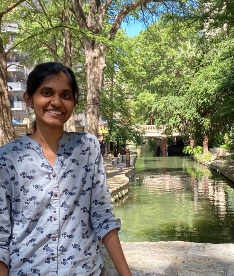

> Table of contents

<li>Our Project</li>
<li>Our Team</li>
<li>Project Charter</li>
<li>Scope</li>
<li>Schedule</li>
<li>Budget</li>

# Our Project : Tick-Tack-Toe

> TagLine : ***leisure*** a ***pleasure***

Description : Tick-Tack-Toe is a fun game in free time .

* Photo : 
* [Sri Vasavi Vipparla](https://github.com/Srivasavi-vipparla)  :as a Product Onwer
* Photo : 
* [Abhilash Ramavaram](https://https://github.com/AbhiRam0099/AbhilashRamavaram):as a Developer

Nuvvala,Manoj as a Scrum Master.

Arla,Madhu Babu as a Designer.

- Project Charter
- Scope
- Schedule:

- Budget
- Our Project
- Introduce your project title and tag line

# Summary:

## The game play will be simple.

* There will be a simple square game board divided into nine tiles or grid spaces.
* When the player clicks on one of the grid spaces, it will be assigned either an "X" or an "O".
* The game is over when one player claims 3 grid spaces in a row or there are no moves left.
* At the start of the game, the board will not be active until the first player has chosen whether they are to play "X" or "O".
* A panel will indicate whose turn it is. When the game is over, a banner will display the winner or announce a draw if no one wins.
* A restart button will be displayed when the game is over, returning the game to the starting state when clicked.
