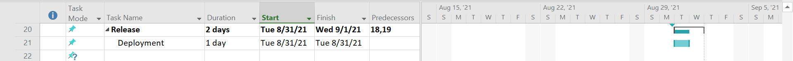

# Team name: TickTack

| S.R NO | TABLE OF CONTENT |
| - | - |
| 1 | [Our Project](https://github.com/Srivasavi-vipparla/pm-s04-03-project/blob/main/README.md#our-project--tick-tack-toe) |
| 2 | [Our Team](https://github.com/Srivasavi-vipparla/pm-s04-03-project/blob/main/README.md#our-team) |
| 3 | [Project Charter](https://github.com/Srivasavi-vipparla/pm-s04-03-project/blob/main/README.md#project-charter) |
| 4 | [Scope](https://github.com/Srivasavi-vipparla/pm-s04-03-project/blob/main/README.md#scope) |
| 5 | [Schedule](https://github.com/Srivasavi-vipparla/pm-s04-03-project/blob/main/README.md#schedule) |
| 6 | [Budget](https://github.com/Srivasavi-vipparla/pm-s04-03-project/blob/main/README.md#budget) |
| 7 | [References](https://github.com/Srivasavi-vipparla/pm-s04-03-project/blob/main/README.md#references) |

# Our Project : Tick-Tack-Toe

>## TagLine : ***leisure*** a ***pleasure***

Description : Tick-Tack-Toe is a fun game in free time .

## Summary:

### The game play will be simple.

* There will be a simple square game board divided into nine tiles or grid spaces.
* When the player clicks on one of the grid spaces, it will be assigned either an "X" or an "O".
* The game is over when one player claims 3 grid spaces in a row or there are no moves left.
* At the start of the game, the board will not be active until the first player has chosen whether they are to play "X" or "O".
* A panel will indicate whose turn it is. When the game is over, a banner will display the winner or announce a draw if no one wins.
* A restart button will be displayed when the game is over, returning the game to the starting state when clicked.

# Our Team

                                                             

[Sri Vasavi Vipparla](https://github.com/Srivasavi-vipparla)   &nbsp;&nbsp;&nbsp;&nbsp;&nbsp;&nbsp;&nbsp;&nbsp; [MANOJ NUVVALA](https://github.com/manojnuvvala)   &nbsp;&nbsp;&nbsp;&nbsp;[Abhilash Ramavaram](https://https://github.com/AbhiRam0099/AbhilashRamavaram)  &nbsp;&nbsp;&nbsp;&nbsp;   [Arla Madhu Babu](https://github.com/Madhuarla)

Sri Vasavi Vipparla As a Product Manager

Nuvvala,Manoj as a Scrum Master.

Abhilash Ramavaram as a Developer

Arla,Madhu Babu as a Designer.

## Project Charter

[projectcharter.md](https://github.com/Srivasavi-vipparla/pm-s04-03-project/blob/main/projectcharter/Project-Charter.xlsx)

## Scope:
> Initiating
* IN this group we are deciding the project and gaining basic information to develop the project.
* We find the similar implemenation for the game and researching.

> Planing
* We are analysing the total budget for this project development.
* Gathering the required staff for this project
* Dividing the work to develop
* Deciding which platform to implement and work.

> Execution
* In this stage we are developing the code for the project.
* And implemeting some testcases
* Deploy the first version of project

> Monitoring and controlling
* We are running the code with all possible testcases 
* If need any changes in our code, we will implement those modules again and test.
* Deploy the second version of project
* If everything is correct, Will do documentation for the Project and Plan for Release.
*
> Closing
* Deploy the final version of project

[WBS.md](https://github.com/Srivasavi-vipparla/pm-s04-03-project/edit/main/WBS/wbs.md)

## Schedule:

Project start date - 5/25/2021

Project end   date - 8/31/2021

Total number of weeks - 14 weeks

#### Initiation

#### Planning

#### Execution

#### Monitoring and control

#### Closing

## Budget

| ID NO | MEMBER | ROLE | PAY FOR HOUR | NO OF HOURS PER WEEK | NO OF WEEKS | CALCULATED PAY |   |
| - | - | - | - | - | - | - | - |
| 101 | Vipparla,Sri Vasav | Product Onwer | $           100.00 | 5 | 14 | $            7,000.00 |   |
| 102 | Nuvvala,Manoj | Scrum Master | $           110.00 | 10 | 14 | $          15,400.00 |   |
| 103 | Ramavaram,Abhilash | Developer | $             85.00 | 20 | 14 | $          23,800.00 |   |
| 104 | Arla,Madhu   Babu | Designer | $             80.00 | 15 | 14 | $          16,800.00 |   |
|   |   |   |   |   |   |   |   |
|   |   |   |   |   |   |   |   |
|   |   |   |   |   | TOTAL BUDGET | $          63,000.00 |   |
|   |   |   |   |   |   |   |   |
|   |   |   |   |   |   |   |   |

[Budget Excel](https://github.com/Srivasavi-vipparla/pm-s04-03-project/blob/main/BUDGET.xlsx)

# References

* [Summary reference](https://learn.unity.com/tutorial/creating-a-tic-tac-toe-game-using-only-ui-components#:~:text=Scope%20of%20the%20Game&text=The%20game%20is%20over%20when,X%22%20or%20%22O%22.)
* [WBS reference](https://online.visual-paradigm.com/diagrams/templates/work-breakdown-structure/work-breakdown-structure-diagram-template/)
* [Project charter](https://www.google.com/search?q=project+charter&rlz=1C1GCEA_enUS936US936&sxsrf=ALeKk018s_TQrL4FV7uTXbaYaNxc7SFBtg:1622249690869&source=lnms&tbm=isch&sa=X&ved=2ahUKEwjVir6E1-3wAhWGLc0KHe1CDTEQ_AUoAXoECAEQAw&biw=1280&bih=578&dpr=1.5#imgrc=ipp1sJsYJoBDsM)

[To the top](https://github.com/Srivasavi-vipparla/pm-s04-03-project/blob/main/README.md#team-name-ticktack)
